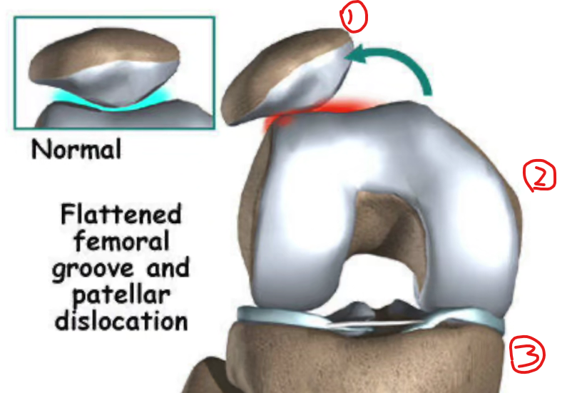

# 膝盖弹响

## 可能性 一
### 表现

    一般在做蹲起的动作的时候
    例如：
        - 蹲厕所起来时，
        - 坐较矮小椅子起来时，
        - 系鞋带起身时；

    反之一样，起身对应下蹲

### 自测方式

    坐椅子上，屈膝抬起测试腿，然后抬起小腿，使得膝盖伸直；
    在此过程中，有人的膝盖就会出现声响。

### 弹响原因

    膝盖伸直过程中，髌骨在股骨滑槽中滑出，所产生的声响；（如图：1-髌骨，2-股骨，3-胫骨）
    因为股四头肌发力不平衡，导致髌骨横移；
    因为腹部肌肉、髂腰肌力量不足，导致股四头肌发力不平衡；

    
